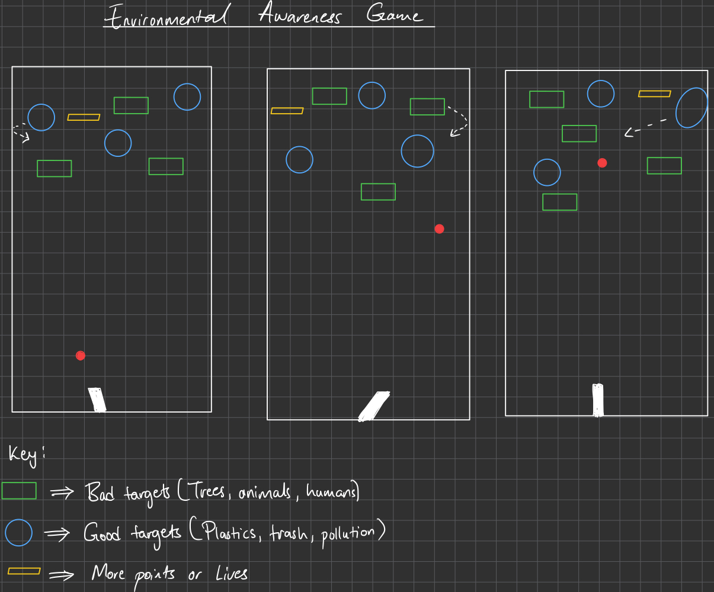

# Environmental Awareness Mode: An Interactive Single-Player Game

"Shoot Smart, Save the Planet!"

Environmental Awareness Mode is a game mode in which players must carefully choose which targets to shoot, rather than hitting everything. Targets represent real-world environmental elements: harmful items like pollution or trash(good targets) should be hit for points, while beneficial elements like trees or wildlife should be avoided(bad targets), or the player loses lives. There’s also a component for bonus points which can give the player more lives and that refers to a person doing good to the environment. This adds a layer of decision-making to the game, encouraging players to think about environmental impact while playing.

